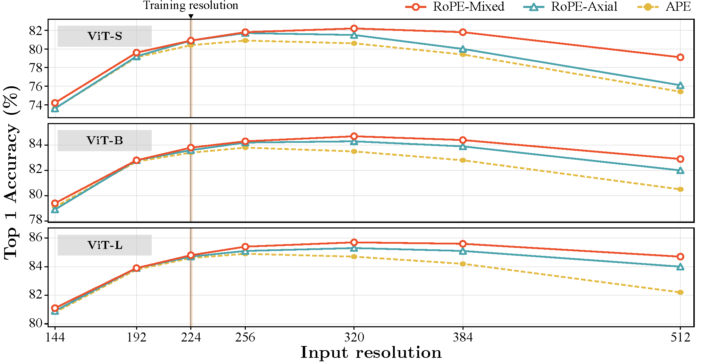
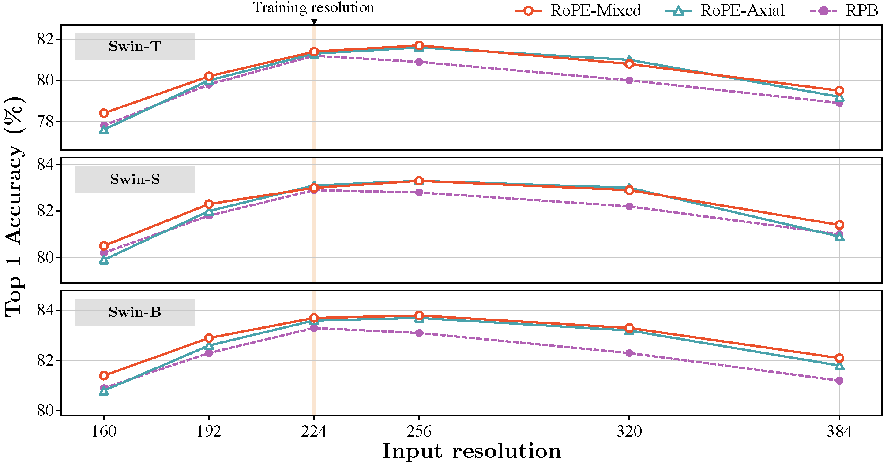

<div align="center">

# Rotary Position Embedding for Vision Transformer

**[Byeongho Heo](https://sites.google.com/view/byeongho-heo/home), [Song Park](https://8uos.github.io/), [Dongyoon Han](https://sites.google.com/site/dyhan0920/), [Sangdoo Yun](https://sangdooyun.github.io/)** <br>

[NAVER AI LAB](https://naver-career.gitbook.io/en/teams/clova-cic/ai-lab)

[](https://arxiv.org/abs/2403.13298)
[](https://www.ecva.net/papers/eccv_2024/papers_ECCV/html/1584_ECCV_2024_paper.php)
[](https://huggingface.co/collections/naver-ai/rope-vit-670e367fa2d547b705335153)

</div>

Official PyTorch implementation of RoPE-ViT "Rotary Position Embedding for Vision Transformer" | [arxiv](https://arxiv.org/abs/2403.13298), [ECCV](https://www.ecva.net/papers/eccv_2024/papers_ECCV/html/1584_ECCV_2024_paper.php)

### Abstract

Rotary Position Embedding (RoPE) performs remarkably on language models, especially for length extrapolation of Transformers. However, the impacts of RoPE on computer vision domains have been underexplored, even though RoPE appears capable of enhancing Vision Transformer (ViT) performance in a way similar to the language domain. This study provides a comprehensive analysis of RoPE when applied to ViTs, utilizing practical implementations of RoPE for 2D vision data. The analysis reveals that RoPE demonstrates impressive extrapolation performance, i.e., maintaining precision while increasing image resolution at inference. It eventually leads to performance improvement for ImageNet-1k, COCO detection, and ADE-20k segmentation. We believe this study provides thorough guidelines to apply RoPE into ViT, promising improved backbone performance with minimal extra computational overhead.


## Updates

- **Oct 16, 2024**: Pre-trained weights are uploaded to [huggingface hub](https://huggingface.co/collections/naver-ai/rope-vit-670e367fa2d547b705335153)
- **Apr 16, 2024**: Pre-trained weights released
- **Apr 15, 2024**: Code released
- **Mar 21, 2024**: Arxiv paper was released

## Getting Started

You can find RoPE implementations at each folder.

- `deit/`   : RoPE on DeiT-III training code *"DeiT III: Revenge of the ViT"* [original repo](https://github.com/facebookresearch/deit)
- `swin/` : RoPE on Swin Transformer training code *"Swin Transformer: Hierarchical Vision Transformer using Shifted Windows"* [original repo](https://github.com/microsoft/Swin-Transformer)
- `models/` : Only RoPE model files that used for DeiT and Swin.
- `self-attn/` : Minimum implementation of RoPE in self-attention layer

## Performances

### DeiT-III



### Swin Transformer




## Pre-trained weights

- You can access the pre-trained weights on our [huggingface hub](https://huggingface.co/collections/naver-ai/rope-vit-670e367fa2d547b705335153)
- `pretrained=True` for models in `models/` will automatically load pre-trained weights from huggingface hub
    ```python
    from models import vit_rope
    model = vit_rope.rope_mixed_deit_small_patch16_LS(pretrained=True)
    from models import swin_transformer_rope
    model = swin_transformer_rope.swin_rope_mixed_tiny_patch4_window7_224(pretrained=True)
    ```
- For inference with `256x256` images
    ```python
    from models import vit_rope
    model = vit_rope.rope_mixed_deit_small_patch16_LS(pretrained=True, img_size=256)
    from models import swin_transformer_rope
    model = swin_transformer_rope.swin_rope_mixed_tiny_patch4_window7_224(pretrained=True, img_size=256)
    ```

### DeiT-III (400 epochs)

| Model Name                                 | Top-1 (224) | Top-1 (384) | Weights                                                                |
|--------------------------------------------|-------------|-------------|------------------------------------------------------------------------|
| deit_small_patch16_LS                      | 80.4        | 79.4        | [HF hub](https://huggingface.co/naver-ai/deit_small_patch16_LS) / [Google drive](https://drive.google.com/file/d/1H6qGggmdfCpryTdUWoKsd_i9pCIia6sx/view?usp=drive_link) |
| rope_axial_deit_small_patch16_LS           | 80.9        | 80.0        | [HF hub](https://huggingface.co/naver-ai/rope_axial_deit_small_patch16_LS) / [Google drive](https://drive.google.com/file/d/1aKN-MeCZqYT1xV7oM1qzdJ7c2VwifuOg/view?usp=drive_link) |
| rope_mixed_deit_small_patch16_LS           | 80.9        | 81.8        | [HF hub](https://huggingface.co/naver-ai/rope_mixed_deit_small_patch16_LS) / [Google drive](https://drive.google.com/file/d/1_P_1s4zIgx9p6WIXhebcsB3haz5ChIVF/view?usp=drive_link) |
| rope_axial_ape_deit_small_patch16_LS       | 80.7        | 81.2        | [HF hub](https://huggingface.co/naver-ai/rope_axial_ape_deit_small_patch16_LS) / [Google drive](https://drive.google.com/file/d/1tFZodFaQegDXGiInHo9D4UrWh7c_KSao/view?usp=drive_link) |
| rope_mixed_ape_deit_small_patch16_LS       | 80.9        | 81.7        | [HF hub](https://huggingface.co/naver-ai/rope_mixed_ape_deit_small_patch16_LS) / [Google drive](https://drive.google.com/file/d/1ss2ZaqQMkzq2WjmuuOlah5sV5eH8cCly/view?usp=drive_link) |
|                                            |             |             |                                                                        |
| deit_base_patch16_LS                       | 83.4        | 82.8        | [HF hub](https://huggingface.co/naver-ai/deit_base_patch16_LS) / [Google drive](https://drive.google.com/file/d/15cq8QM-PE2b7s_UpVzeaGX2W6Nc7Apsb/view?usp=drive_link) |
| rope_axial_deit_base_patch16_LS            | 83.6        | 83.9        | [HF hub](https://huggingface.co/naver-ai/rope_axial_deit_base_patch16_LS) / [Google drive](https://drive.google.com/file/d/1HJdWKvABOuHyB3EOLUAQpX-nZ8sj0FhW/view?usp=drive_link) |
| rope_mixed_deit_base_patch16_LS            | 83.8        | 84.4        | [HF hub](https://huggingface.co/naver-ai/rope_mixed_deit_base_patch16_LS) / [Google drive](https://drive.google.com/file/d/1zXOd2oFErFRYwY4drzP-whqXOt_fBS57/view?usp=drive_link) |
| rope_axial_ape_deit_base_patch16_LS        | 83.7        | 83.8        | [HF hub](https://huggingface.co/naver-ai/rope_axial_ape_deit_base_patch16_LS) / [Google drive](https://drive.google.com/file/d/1IkY_mmqcVmVZgY4wOFD__SHvCwFi4wz1/view?usp=drive_link) |
| rope_mixed_ape_deit_base_patch16_LS        | 83.8        | 84.3        | [HF hub](https://huggingface.co/naver-ai/rope_mixed_ape_deit_base_patch16_LS) / [Google drive](https://drive.google.com/file/d/1gJNjDmSL1ouQvUNoXujbCB1OYCv85mdv/view?usp=drive_link) |
|                                            |             |             |                                                                        |
| deit_large_patch16_LS                      | 84.6        | 84.2        | [HF hub](https://huggingface.co/naver-ai/deit_large_patch16_LS) / [Google drive](https://drive.google.com/file/d/1x_3MJbsmyaQGTOA2rnLxjf-a7_56tK4Q/view?usp=drive_link) |
| rope_axial_deit_large_patch16_LS           | 84.7        | 85.1        | [HF hub](https://huggingface.co/naver-ai/rope_axial_deit_large_patch16_LS) / [Google drive](https://drive.google.com/file/d/1RVh1BpWadeU0jk_8Ej6Ihv9mBIdbnFgQ/view?usp=drive_link) |
| rope_mixed_deit_large_patch16_LS           | 84.8        | 85.6        | [HF hub](https://huggingface.co/naver-ai/rope_mixed_deit_large_patch16_LS) / [Google drive](https://drive.google.com/file/d/1dAtfu_zHM_kD7f4FXfa599RkL_tvzbSz/view?usp=drive_link) |
| rope_axial_ape_deit_large_patch16_LS       | 84.7        | 85.1        | [HF hub](https://huggingface.co/naver-ai/rope_axial_ape_deit_large_patch16_LS) / [Google drive](https://drive.google.com/file/d/1i90kxopHZ8KoDQFRsFrU5Zw2I9qB4qIn/view?usp=drive_link) |
| rope_mixed_ape_deit_large_patch16_LS       | 84.9        | 85.5        | [HF hub](https://huggingface.co/naver-ai/rope_mixed_ape_deit_large_patch16_LS) / [Google drive](https://drive.google.com/file/d/1wQ6uzRl6ncWnTYaHOx4iZB-D-7NMcKQ9/view?usp=drive_link) |

### Swin Transformer (300 epochs)

| Model Name                                 | Top-1 (224) | Top-1 (384) | Weights                                                                 |
|--------------------------------------------|-------------|-------------|------------------------------------------------------------------------|
| swin_tiny_patch4_window7_224               | 81.2        | 78.9        |                                                                        |
| swin_rope_axial_tiny_patch4_window7_224    | 81.3        | 79.2        | [HF hub](https://huggingface.co/naver-ai/swin_rope_axial_tiny_patch4_window7_224) / [Google drive](https://drive.google.com/file/d/1pfTRCrak5CxVbJcU19xMsksnQntEuZYz/view?usp=drive_link) |
| swin_rope_mixed_tiny_patch4_window7_224    | 81.4        | 79.5        | [HF hub](https://huggingface.co/naver-ai/swin_rope_mixed_tiny_patch4_window7_224) / [Google drive](https://drive.google.com/file/d/1vvzr6nyluoVJ4t_0PclcUMlNWuZPXJdL/view?usp=drive_link) |
|                                            |             |             |                                                                        |
| swin_small_patch4_window7_224              | 82.9        | 81.0        |                                                                        |
| swin_rope_axial_small_patch4_window7_224   | 83.1        | 80.9        | [HF hub](https://huggingface.co/naver-ai/swin_rope_axial_small_patch4_window7_224) / [Google drive](https://drive.google.com/file/d/1sEQZ7QQZ-zzuQ0Gx4yh8n0jbI0CP7g44/view?usp=drive_link) |
| swin_rope_mixed_small_patch4_window7_224   | 83.0        | 81.4        | [HF hub](https://huggingface.co/naver-ai/swin_rope_mixed_small_patch4_window7_224) / [Google drive](https://drive.google.com/file/d/1CrFOmnQXQYmK9fT4nLIcVT338wz3Nbnn/view?usp=drive_link) |
|                                            |             |             |                                                                        |
| swin_base_patch4_window7_224               | 83.3        | 81.2        |                                                                        |
| swin_rope_axial_base_patch4_window7_224    | 83.6        | 81.8        | [HF hub](https://huggingface.co/naver-ai/swin_rope_axial_base_patch4_window7_224) / [Google drive](https://drive.google.com/file/d/1BXOUQRrBlUUf3TpKQFWsVsWSR_j9JMNO/view?usp=drive_link) |
| swin_rope_mixed_base_patch4_window7_224    | 83.7        | 82.1        | [HF hub](https://huggingface.co/naver-ai/swin_rope_mixed_base_patch4_window7_224) / [Google drive](https://drive.google.com/file/d/1sHxm_nh7t8Y1-GY7sHqiqfvVe_fFCkho/view?usp=drive_link) |


## How to cite

```
@inproceedings{heo2024ropevit,
    title={Rotary Position Embedding for Vision Transformer},
    author={Heo, Byeongho and Park, Song and Han, Dongyoon and Yun, Sangdoo},
    year={2024},
    booktitle={European Conference on Computer Vision (ECCV)},
}
```

## License

This project is distributed under [Apache-2.0](LICENSE_rope-vit), <br>
except for the files below which originated from [https://github.com/meta-llama/codellama](https://github.com/meta-llama/codellama).
- [deit/models_v2_rope.py](deit/models_v2_rope.py)
- [models/swin_transformer_rope.py](models/swin_transformer_rope.py)
- [models/vit_rope.py](models/vit_rope.py)
- [self-attn/rope_self_attn.py](self-attn/rope_self_attn.py)
- [Swin-Transformer/models/swin_transformer_rope.py](Swin-Transformer/models/swin_transformer_rope.py)

```
RoPE-ViT
Copyright (c) 2024-present NAVER Cloud Corp.

Licensed under the Apache License, Version 2.0 (the "License");
you may not use this file except in compliance with the License.
You may obtain a copy of the License at

    http://www.apache.org/licenses/LICENSE-2.0

Unless required by applicable law or agreed to in writing, software
distributed under the License is distributed on an "AS IS" BASIS,
WITHOUT WARRANTIES OR CONDITIONS OF ANY KIND, either express or implied.
See the License for the specific language governing permissions and
limitations under the License.
```